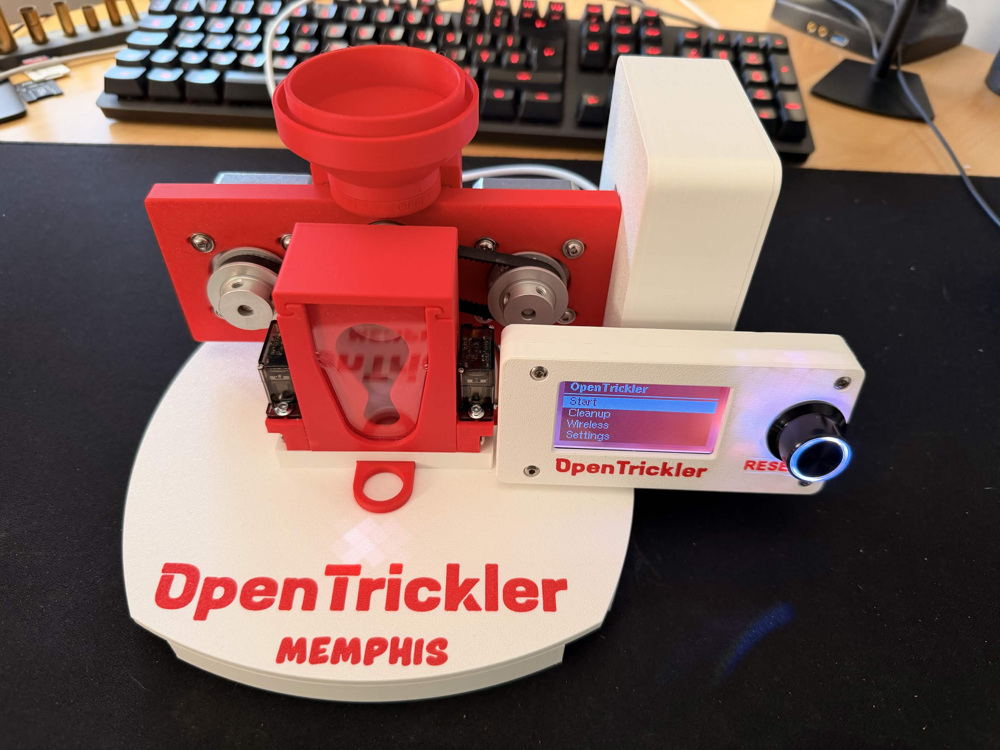

# A&D FX Lid for OpenTrickler by Memphis

I will complete this guide with photos as soon as possible.

## BOM

| Name | Picture | Quantity | Buy |
|:------:|:------:|:------:|:------:|
| Heatset Inserts M3xL4xOD5                          |  | 27 | [Aliexpress](https://fr.aliexpress.com/item/1005006472702418.html) |
| Magnet 8x2mm                                       |          | 8  |                                                                    |
| M3x8 BHCS                                          |                | 1  |                                                                    |
| M3x10 BHCS                                         |                | 17 |                                                                    |
| M3x20 BHCS                                         |                | 8  |                                                                    |
| Shim washer OD=6mm, ID=3mm, Thick=0.5mm            |                | 10 |                                                                    |
| Shot glass (height: 50mm, diameter at top: 41.6mm) |      | 1  |                                                                    |
| O-ring 35mm in diameter (Optionnal)                |              | 1  |                                                                    |
| WS2812B (led stripe or led on PCB)                 |              | 1  | [Aliexpress](https://fr.aliexpress.com/item/1005007982624217.html) [Aliexpress](https://fr.aliexpress.com/item/32560280169.html) |
The links are not affiliate links.

## Print and assembly guide

To download all the files: [All The Files ZIP](3MF/AllTheFiles.zip)

### Rear body

| Parts name | Quantity |
|:------:|:------:|
| Heatset Inserts            | 6 |
| M3x8 BHCS                  | 8 |
| Shim Washer                | 8 |
| 6804 Bearing               | 1 |
| 6801 Bearing               | 1 |
| Nema 17 Stepper Motor      | 2 |
| GT2 belt 166mm             | 1 |
| GT2 belt 174mm             | 1 |
| 40 Teeth GT2 Timing Pulley | 2 |

[Rear body without holes on the left](3MF/RearBodyWithoutHolesOnTheLeft.3mf)  
[Rear volume reducer](3MF/OpenTricklerOrignalParts/RearVolumeReducer.3mf)  
[Rear door](3MF/OpenTricklerOrignalParts/RearDoor.3mf)  
[Volume reducer back](3MF/OpenTricklerOrignalParts/RearVolumeReducerBack.3mf)  
[Large rotary tube](3MF/OpenTricklerOrignalParts/LargeRotaryTube.3mf)  
[Small rotary tube (Low flow)](3MF/OpenTricklerOrignalParts/SmallRotaryTube_LowFlowTube.3mf) 

### Front body

| Parts name | Quantity |
|:------:|:------:|
| Heatset Inserts            | 4 |
| 6804 Bearing               | 1 |
| 6801 Bearing               | 1 |
| Plexiglass sheet. Thickness: 2 mm. Dimensions: 37x62.5 mm | 1 |

[Front body whithout servos with acrylic ](3MF/FrontBody/FrontBodyWhitoutServoWithAcrylic.3mf)  
[Front volume reducer with hole](3MF/FrontBody/FrontVolumeReducerWithHole.3mf)  
[Front volume reducer back](3MF/OpenTricklerOrignalParts/FrontVolumeReducerBack.3mf)  
[Front cover with hole](3MF/FrontBody/FrontBodyCoverWithHole.3mf)  
[Cap with hole](3MF/FrontBody/CapWithHole.3mf)  
[Cap without hole](3MF/FrontBody/Cap.3mf)  
[Front cover](3MF/FrontBody/FrontCover.3mf) (If you Don't have plexiglasse sheet)

### Interface

[Interface without servos](3MF/Interface/Interface.3mf) or [Interface with servos](3MF/Interface/InterfaceWithServos.3mf)  
[Interface front flap](3MF/Interface/InterfaceFrontFlap.3mf)  
[Interface rear flap](3MF/Interface/InterfaceRearFlap.3mf)

 

### Lid

| Parts name | Quantity |
|:------:|:------:|
| Heatset Inserts | 6 |
| Magnets         | 4 |

[Lid without servos](3MF/Lid/Lid_NoServos.3mf) or [Lid with servos](3MF/Lid/Lid_Servos.3mf)  

### Assemble the front body, the rear body and the interface on the lid

| Parts name | Quantity |
|:------:|:------:|
| M3x20 BHCS | 8 |

### Display

| Parts name | Quantity |
|:------:|:------:|
| Heatset Inserts (Only 6 for the version with button on the right) | 7 |
| M3x10 BHCS                                                        | 4 |
| Mini 12864 Display with Controller (Fly or bigtreetech)           | 1 |

[Bigtreetech back](3MF/Display/BigTreetechScreen_Back.3mf)  
[Bigtreetech front](3MF/Display/BigTreetechScreen_Front.3mf)  

[Fly back button on the left](3MF/Display/FlyScreen_Back.3mf)  
[Fly front button on the left](3MF/Display/FlyScreen_Front.3mf)  

[Fly back button on the right](3MF/Display/FlyScreen_RightButton_Back.3mf)  
[Fly front button on the right](3MF/Display/FlyScreen_RightButton_Front.3mf)  

### Assemble the display on the lid
| Parts name | Quantity |
|:------:|:------:|
| M3x10 BHCS | 3 |

Only 2 screws for the version with button on the right.  

Route the screen cables through the cover to the back.

### PCB enclosure 
| Parts name | Quantity |
|:------:|:------:|
| Heatset Inserts | 4 |

[Enclosure](3MF/PCB/Enclosure.3mf)  

### Assemble the PCB enclosure onto the rear body
| Parts name | Quantity |
|:------:|:------:|
| M3x8 BHCS | 2 |

### Led (Optionnal)
| Parts name | Quantity |
|:------:|:------:|
| WS2812B (led stripe or led on PCB)   | 1 |
| Wire (200 mm)                        | 3 |
| 3pin JST (2.54pitch) connector       | 1 |

[Lid LED Strip AddOn](3MF/Lid_LEDStrip_AddOn.3mf) Print this part if you use a led strip.  
Use one of the connectors provided with the 3D mellow PCB.  
Be sure to use the LED's DI pin.  

Position your LED and route the wires to the back.

### PCB installation
| Parts name | Quantity |
|:------:|:------:|
| M3x10 BHCS | 4 |

Route all cables into the PCB enclosure.  
Connect them to the PCB.  
Secure the PCB in the enclosure using the four M3x10 screws.  

You can now test your OpenTrickler.  
If everything is OK, proceed to the next step.  

### Close the PCB enclosure

[Enclosure LID](3MF/PCB/Enclosure_Lid.3mf)  

### Close the lid
| Parts name | Quantity |
|:------:|:------:|
| M3x10 BHCS  | 6 |

[Lid wire cover](3MF/Lid/Lid_WireCover.3mf)  
[Small cable block](3MF/Lid/SmallCableLock.3mf)  
[Big cable block](3MF/Lid/BigCableBlock.3mf)  

### Powder hopper
| Parts name | Quantity |
|:------:|:------:|
| M3x8 BHCS                                 | 1 |
| Shim Washer (OD=6mm, ID=3mm, Thick=0.5mm) | 2 |
| Clear acrylic tube (OD: 60mm, ID: 56mm)   | 1 |

[Hopper base plexi](3MF/Hopper/HopperBasePlexi.3mf)  
[Hopper cap](3MF/Hopper/HopperCap.3mf)  
[Rear body interface modified](3MF/RearBodyInterfaceModified.3mf)  I modify this parts to fit easily

### Funnel & Powder bin
| Parts name | Quantity |
|:------:|:------:|
| Magnets (8x2mm) | 4 |

[Powder bin](3MF/Lid/PowderBin.3mf)  
[Power bin bracket](3MF/Lid/PowderBinBracket.3mf)  
[Powder funnel](3MF/Lid/Funnel33mm.3mf)  

Place two magnets in the bin holder.
Assemble the bin and its holder with strong glue.

Place two magnets in the funnel. The default funnel measures 33mm. Contact me to adapt it to your shot glass.

### Powder cup
| Parts name | Quantity |
|:------:|:------:|
| Shot glass, height: 50mm, diameter at top: 41.6mm | 1 |
| An o-ring 35mm in diameter                        | 1 |

[Powder cup handle](3MF/PowderCuphandle.3mf)

It is possible not to use the o-ring if your print is very tight.  

### Cup stop 
[Cup stop](3MF/CupStop.3mf)  

Glue it on with a school glue stick.  

That's it, it's finished. Congratulations!

 

