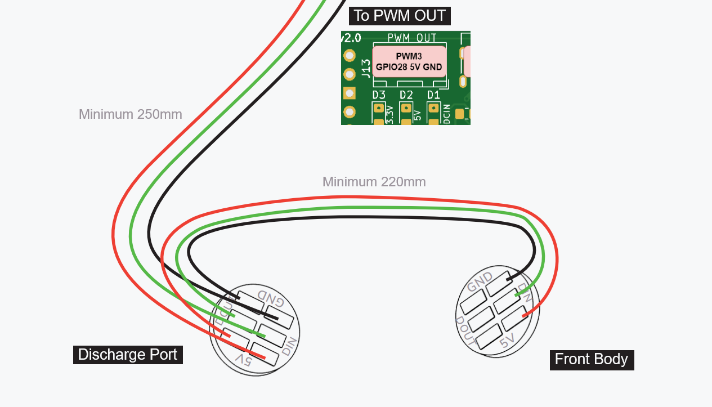

# Neopixel LED Mod

## Declaimer

- The mod is build based on [OpenTrickler v2.0.1 release](https://github.com/eamars/OpenTrickler/releases/tag/v2.0.1). The mod may not be compatible of future OpenTrickler releases. 
- The scale shield mod only works for A&D FX series scales only. 

## BOM

- 2x Neopixel RGBW Button PCB - [Link to Adafruit](https://www.adafruit.com/product/4776)
- 420 mm AWG24-26 three lead cable
- Raspberry Pi Pico Motor Expansion Board V2, or v1 + [pwm_expansion_board](https://github.com/eamars/RaspberryPi-Pico-Motor-Expansion-Board/tree/main/archive/pwm_expansion_board)

## Preparations

1. Cut the three lead cable in two lengths: 220mm and 200mm. 
2. Solder one end of *220mm* cable to the **DIN** side of the Neopixel LED, pointing towards the **outside** edge of the PCB. 
3. Solder the other end of *220mm* cable to the **DIN** side of another Neopixel LED, pointing towards the **outside** edge of the PCB.
4. Crimp one end of *200mm* cable with 3pin JST (2.54pitch) connector. 
5. Solder the other end of the *200mm* cable to the **DOUT** side of the Neopixel LED, pointing towards the **inside** of the PCB. 

## Print and Assembly Guide

Install the Neopixel LED (with both in and out cables) to the pocket of [front_discharger_mount_with_led.stl](STL/front_discharger_mount_with_led.stl). Make sure both cables are tucked into the cable channel and stay in flush or below than the top surface. 

Continue with front and rear body assembly. Once the OpenTrickler is mounted to the [trickler_adapter_plate.stl](STL/trickler_adapter_plate.stl), you need to run the cable with the Neopixel LED, from the front discharger mount, through the cut out behind the [front_body_with_shutter_with_led.stl](STL/front_body_with_shutter_with_led.stl), following the red line as shown below: The other cable with JST connector (blue line) can be left floating at this stage. 

Install the Neopixel LED (with only one set of cable) to the pocket of [FrontVolumeReductionInsert_Bottom_with_LED.stl](STL/FrontVolumeReductionInsert_Bottom_with_LED.stl), and run the cable through the cable channel on [FrontVolumeReductionInsert_Top_with_LED.stl.stl](STL/FrontVolumeReductionInsert_Top_with_LED.stl.stl) and [front_body_with_shutter_with_led.stl](STL/front_body_with_shutter_with_led.stl)

Side the front body cover and the OpenTrickler assembly is complete. The last step is to ensure both cables are sitting nicely in the cut out on [scale_shield_with_led.stl](STL/scale_shield_with_led.stl). Pluging the cable to the PWNOUT port on the controller board and your assembly is now complete. 

## Configuration

You will need [OpenTrickler Controller v1.12](https://github.com/eamars/OpenTrickler-RP2040-Controller/releases/tag/v1.12) or newer firmware. By default the firmware will mirror the LED1 colour (from mini12864 display) to PWM_OUT port. 

In the new firmware, you need to check below settings: 

- PWM3 Chain Count: The number of LEDs on the same chain. This mod uses 2 therefore you need to select 2 here. 
- Is RGBW LED?: Depending on the type of LED you are using, this mod uses RGBW (ws2812b) therefore you need to select Yes here. 

